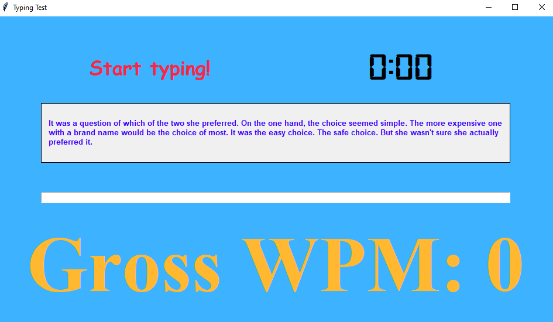
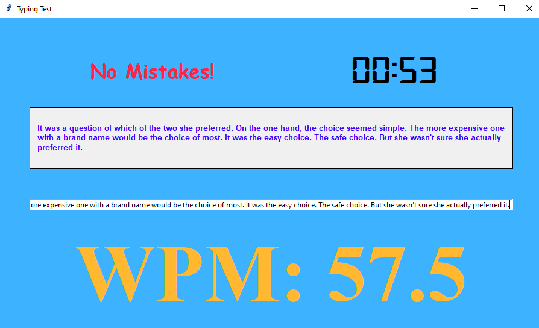

# TypingTester
This program made with Python's popular GUI module Tkinter tests your touch typing skills and outputs your GROSS WPM on the screen. 
# Install
```
$ pip install -r requirements.txt
```
# Usage
- Start typing the paragraph shown on the screen in the space given.
- This will start the timer, continue typing....
- Once you are done, the WPM(Words per Minute) will be displayed on the screen.
# Preview


